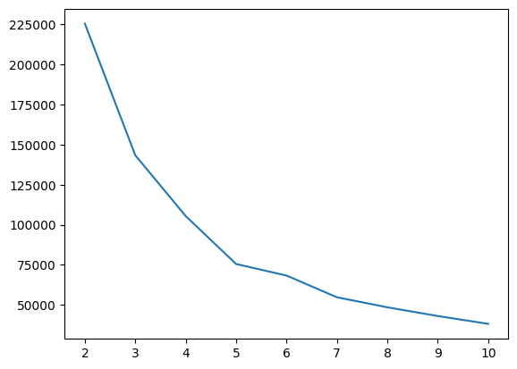
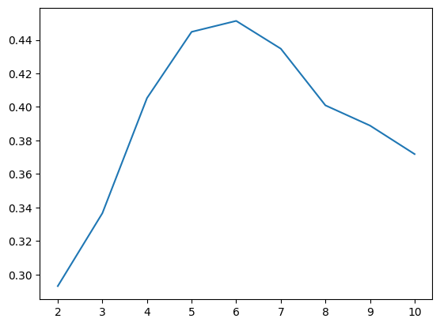

KMeans
======

>KMeans 최적의 K 값 찾기
- Elbow Method
    - inertia가 급격히 떨어지는 지점의 K 값을 최적의 값으로 설정
        -  inertia : 각 cluster 내의 모든 샘플과 centroid 사이의 거리 제곱 합

    ```python
    distance = []
    for i in range(2, 11):
        model = KMeans(n_clusters = i)
        model.fit(data)
        distance.append(model.inertia_)
    
    # Elbow Plot 
    sns.lineplot(x = list(range(2, 11)), y = distance)
    ```
    - Elbow Plot
    

    - Limitation of Elbow Plt
      - plot이 위와 같이 smooth 하게 나올 경우, 어디가 최적의 K 값인지 알기 어려움

- Silhouatte Score
    - cluster의 수가 늘어날수록, inertia의 값은 줄어들지만, 의미없는 분할일 수 있음(cluster 간의 거리가 매우 가까울 경우)
    - **inertia + 각 cluster의 거리까지 고려**
        - 잘 된 clustering은 각각의 cluster간의 거리가 멀다는 것을 전제
    - Silhouatte Score 값이 가장 큰 지점의 K 값을 최적의 값으로 설정

    ```python
    # Import Silhoutte Score 
    from sklearn.metrics import silhouette_score

    sil = []
    for i in range(2,11):
        model = KMeans(n_clusters = i)
        model.fit(data)

        sil.append(silhouette_score(data, model.labels_))

    # silhouette score plot
    sns.lineplot(x = list(range(2,11)), y = sil)
    ```
    
    - Elbow Plot에 비해 뚜렷하게 6이 촤적의 cluster 개수임을 확인할 수 있다


